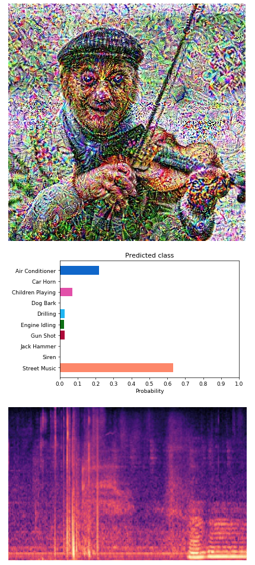

# Interactive audio-visual hallucinations
Members: Thom Miano

### Overview

Convolutional Neural Networks (CNNs) are widely used for machine learning tasks involving digital images. When digital images are sampled, light intensity is captured at some range along the electromagnetic spectrum, with mul- tiple ranges (i.e., ”channels”) possibly being captured. CNNs are effective at finding patterns in images as they re- lated to some outcome of interest (e.g., the identification of an object) without explicit indication from humans through manual feature engineering. Digital audio is a representa- tion of waveforms in discrete samples, where each sample value has some amplitude and the frequency of the sound is defined by the number of samples that fall within a cy- cle. CNNs have been used on audio far less frequently than they have been used on images. The goal of this project is to build a real-time environmental sound classifier that can be plugged into a visualization generator for real-time visu- alizations of predicted sounds. The visualization generator could take on many forms, and in this paper we investigate generating spectrograms as well as fixed class images that have Deep Dream applied.

# Catalogue of references

### Libraries

 - v4l2loopback
 - ffmpeg
 - pygame – Render visualization to screen
 - Train a recurrent neural network on a dataset of sounds, which includes things like bird songs, dog barks, and industrial noises. The output of a trained model will be a probability vector of some input sound. I am not experienced with RNNs, so I will need feedback from the instructor(s) on appropriate ways to approach this. One thought I’ve had is to incorporate convolutional layers by first converting the sound input to a spectrogram like the following [1]:

### Possible datasets

<u>Urbansound</u>

This dataset contains 1302 labeled sound recordings. Each recording is labeled with the start and end times of sound events from 10 classes: air_conditioner, car_horn, children_playing, dog_bark, drilling, enginge_idling, gun_shot, jackhammer, siren, and street_music. Each recording may contain multiple sound events, but for each file only events from a single class are labeled.
https://serv.cusp.nyu.edu/projects/urbansounddataset/urbansound.html

<u>Urbansound8k</u>

This dataset contains 8732 labeled sound excerpts (<=4s) of urban sounds from 10 classes: air_conditioner, car_horn, children_playing, dog_bark, drilling, enginge_idling, gun_shot, jackhammer, siren, and street_music.

<u>Freesound 4 seconds </u>

A mirror of all 126,900 sounds on Freesound less than 4 seconds long, as of April 4, 2017. Metadata for all sounds is stored in the json.zip files, and the high quality mp3s are stored in the mp3.zip files.
https://archive.org/details/freesound4s

### Sensors
 - Sensel Morph: https://sensel.com/collections/all-products
  - Over 20,000 pressure sensors 5g - 5kg sensing range of 32,000 levels per-touch.

### References

 - [1] aqibsaeed. Urban-Sound-Classification. https://github.com/aqibsaeed/Urban-Sound-Classification
 - [2] Nguyen et al.. Plug & Play Generative Networks. http://www.evolvingai.org/ppgn. Github: https://github.com/Evolving-AI-Lab/ppgn
 - [3] Jonah Nordberg. Google deep dream zoom. https://www.youtube.com/watch?v=dbQh1I_uvjo 
 - Kyle McDonald. AudioNotebooks. https://github.com/kylemcdonald/AudioNotebooks
 - Manny Tan & Kyle McDonald. Bird Sounds: Thousands of bird sounds visualized using machine learning. https://experiments.withgoogle.com/ai/bird-sounds
 - Installing PyTorch on the NVIDIA Jetson TX1/TX2. https://github.com/andrewadare/jetson-tx2-pytorch
 - Deep reinforcement learning - NVIDIA Jetson TX2. https://github.com/dusty-nv/jetson-reinforcement
 - Owens et al.. Visually Indicated Sounds. http://vis.csail.mit.edu/
yrevar. Imagine classes and labels. https://gist.github.com/yrevar/942d3a0ac09ec9e5eb3a
 - Recurrent Neural Networks. https://leonardoaraujosantos.gitbooks.io/artificial-inteligence/content/recurrent_neural_networks.html
 - Mario Klingemann. Controlling PPGN hyperparameters in real time with MIDI controller. https://twitter.com/quasimondo/status/807607666478608385 
 - Realtime audio visualization in python. https://www.swharden.com/wp/2016-07-19-realtime-audio-visualization-in-python/ 
 - Python script to continuously record audio from a microphone and dumps out an image (20)fps, taking about 100 ms to record audio
 - Realtime fft audio visualization with python. https://www.swharden.com/wp/2013-05-09-realtime-fft-audio-visualization-with-python/ 
 - Class to record audio continuously 
 - ConvNet.js. http://cs.stanford.edu/people/karpathy/convnetjs/
 - Sensory Percussion: http://sunhou.se/sensorypercussion.html
  - Sensory Percussion uses a combination of sensors to directly capture the vibrations of your entire drum. It is designed to isolate your drum from ambient noise so you can use it on stage and in loud environments. Though it uses multiple sensors, it operates like a traditional phantom-powered mono microphone and uses standard XLR connectors.
