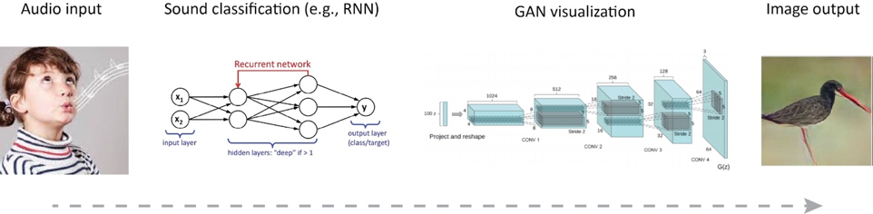
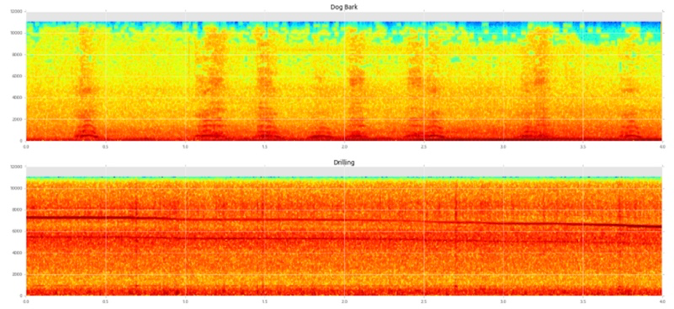

# Interactive audio-visual hallucinations
Members: Thom Miano

### Overview

Input: (Live) Audio data
Output: Generative visualization corresponding to input

I will train models that generate classification probability vectors of audio inputs. I will take the output of these models and run them through a “selection” function, which could be something like a classifier or something simple like choosing the greatest P probabilities. The output of this selection function is the input to a Generative Adversarial Network (GAN) that outputs a visualization.

Image sources, left to right:
1. http://www.metroparent.com/daily/family-fun/family-activities/teaching-kids-whistle/ 2. https://leonardoaraujosantos.gitbooks.io/artificial-inteligence/content/image_folder_6/recurrent.jpg 3. https://arxiv.org/pdf/1511.06434.pdf 4. http://www.evolvingai.org/ppgn

### More detailed description

<u>Part 1: Sound prediction probabilities </u>

Train a recurrent neural network on a dataset of sounds, which includes things like bird songs, dog barks, and industrial noises. The output of a trained model will be a probability vector of some input sound. I am not experienced with RNNs, so I will need feedback from the instructor(s) on appropriate ways to approach this. One thought I’ve had is to incorporate convolutional layers by first converting the sound input to a spectrogram like the following [1]:

At least one challenge with adding the spectrogram conversion step is that it could be a sufficiently expensive process such that the final output frame rate is slow enough that it appears “choppy” to a viewer. This is something that will need to be evaluated, and it is tied to one of the final metrics — frame rate fidelity.

<u>Part 2: Generative adversarial network</u>

Train a GAN or fine tune a pre-existing GAN (e.g., PPGN[2]) that takes as input a label (e.g., “red shank”, a bird) and outputs an image of that target. Even if a pre-built GAN like PPGN is used, effort will need to be put in to making the output stream to pixels on a screen rather than to a file on disk. Additionally, beyond just having a single image generated on screen, I’d like to have the top probabilities generated simultaneously as a continuous image, somewhat like the deep dream images [3].

<u>Metrics</u>

The final metric still needs to be quantified more fully, but it will be some combination of (1) output resolution and clarity (the latter somewhat subject) and (2) frame rate. For the models specifically, I will consider various metrics referenced in the literature that can be used to produce more accurate outputs.   

### Libraries

 - v4l2loopback
 - ffmpeg
 - pygame – Render visualization to screen
 - Train a recurrent neural network on a dataset of sounds, which includes things like bird songs, dog barks, and industrial noises. The output of a trained model will be a probability vector of some input sound. I am not experienced with RNNs, so I will need feedback from the instructor(s) on appropriate ways to approach this. One thought I’ve had is to incorporate convolutional layers by first converting the sound input to a spectrogram like the following [1]:

### Possible datasets

<u>Urbansound</u>

This dataset contains 1302 labeled sound recordings. Each recording is labeled with the start and end times of sound events from 10 classes: air_conditioner, car_horn, children_playing, dog_bark, drilling, enginge_idling, gun_shot, jackhammer, siren, and street_music. Each recording may contain multiple sound events, but for each file only events from a single class are labeled.
https://serv.cusp.nyu.edu/projects/urbansounddataset/urbansound.html

<u>Urbansound8k</u>

This dataset contains 8732 labeled sound excerpts (<=4s) of urban sounds from 10 classes: air_conditioner, car_horn, children_playing, dog_bark, drilling, enginge_idling, gun_shot, jackhammer, siren, and street_music.

<u>Freesound 4 seconds </u>

A mirror of all 126,900 sounds on Freesound less than 4 seconds long, as of April 4, 2017. Metadata for all sounds is stored in the json.zip files, and the high quality mp3s are stored in the mp3.zip files.
https://archive.org/details/freesound4s

### References

 - [1] aqibsaeed. Urban-Sound-Classification. https://github.com/aqibsaeed/Urban-Sound-Classification
 - [2] Nguyen et al.. Plug & Play Generative Networks. http://www.evolvingai.org/ppgn. Github: https://github.com/Evolving-AI-Lab/ppgn
 - [3] Jonah Nordberg. Google deep dream zoom. https://www.youtube.com/watch?v=dbQh1I_uvjo 
 - Kyle McDonald. AudioNotebooks. https://github.com/kylemcdonald/AudioNotebooks
 - Manny Tan & Kyle McDonald. Bird Sounds: Thousands of bird sounds visualized using machine learning. https://experiments.withgoogle.com/ai/bird-sounds
 - Installing PyTorch on the NVIDIA Jetson TX1/TX2. https://github.com/andrewadare/jetson-tx2-pytorch
 - Deep reinforcement learning - NVIDIA Jetson TX2. https://github.com/dusty-nv/jetson-reinforcement
 - Owens et al.. Visually Indicated Sounds. http://vis.csail.mit.edu/
yrevar. Imagine classes and labels. https://gist.github.com/yrevar/942d3a0ac09ec9e5eb3a
 - Recurrent Neural Networks. https://leonardoaraujosantos.gitbooks.io/artificial-inteligence/content/recurrent_neural_networks.html
 - Mario Klingemann. Controlling PPGN hyperparameters in real time with MIDI controller. https://twitter.com/quasimondo/status/807607666478608385 
 - Realtime audio visualization in python. https://www.swharden.com/wp/2016-07-19-realtime-audio-visualization-in-python/ 
 - Python script to continuously record audio from a microphone and dumps out an image (20)fps, taking about 100 ms to record audio
 - Realtime fft audio visualization with python. https://www.swharden.com/wp/2013-05-09-realtime-fft-audio-visualization-with-python/ 
 - Class to record audio continuously 
 - ConvNet.js. http://cs.stanford.edu/people/karpathy/convnetjs/
